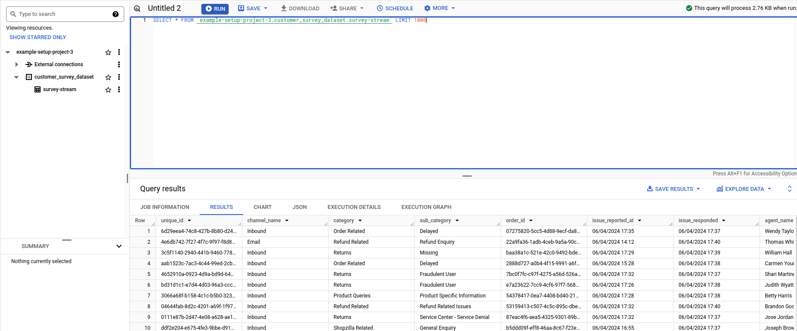

# Problem statement

This project aims to simulate an event streaming data pipeline to process responses to a customer service satisfaction survey of a fictional e-commerce site called Shopzilla.

The data contains information about the issue opened by the customer, the agent who handled the issue, and the score of the service.

After processing the data, the dashboard will be able to display information about the agents with the highest average CSAT score, the most common category of issues and the number of responses over time.

The data generated is based on the [eCommerce Customer Service Satisfaction](https://www.kaggle.com/datasets/ddosad/ecommerce-customer-service-satisfaction) dataset from Kaggle.

# Architecture Diagram


# Technologies

The technologies used in this project are:

* **Google Cloud Platform**: Cloud platform used to store the processed data in a BigQuery dataset. 
* **Terraform**: Tool that provides Infrastructure as Code (IaC) to generate our resources in the cloud (buckets and datasets).
* **Kafka**: Data streaming platform used to capture the real-time events from the data source.
* **Spark**: Receives the event streaming from Kafka using PySpark and performs transformations on the data.
* **Big Query**: Serverless data warehouse used to store the data into partitioned and clustered tables. 
* **Looker Studio**: Used to build the dashboard to visualise and analyse the data.

# Step-by-Step Guide:

## Requirements:

* Install the following tools:
  * [Terraform](https://www.terraform.io/downloads)
  * [Docker](https://docs.docker.com/get-docker/) and [Docker Compose](https://docs.docker.com/compose/install/)

## 1. Deploy Cloud Infrastructure
Create a GCP project and create a *Service Account* with the following permissions:
- `BigQuery Admin`
- `Storage Admin`
- `Storage Object Admin`
- `Viewer`

Make sure that these APIs are enabled:
* https://console.cloud.google.com/apis/library/iam.googleapis.com
* https://console.cloud.google.com/apis/library/iamcredentials.googleapis.com
* https://console.cloud.google.com/apis/library/bigquery.googleapis.com
* https://console.cloud.google.com/apis/library/dataform.googleapis.com

Download the Service Account json file, rename it to `google_credentials_project.json` and store it in `$HOME/.google/credentials/` .

## 2. Change terraform/variables.tf up to your GCP Project ID.

## 3. Set up Infrastructure using Terraform:

* **Go to the `/terraform` folder**:
	```sh
	 cd ./terraform
  ```
* **Initialize terraform**:
	```sh
	 terraform init
  ```
* **Check that you're creating the correct resources (GCS bucket and BigQuery dataset)**:
    ```sh
    terraform plan
    ```
* **Create the resources**:
    ```sh
    terraform apply
    ```

## 4. Start the docker containers:
* **cd back to the main project folder**:
	```sh
	 cd ..
  ```

* **Build docker services** (It may take some time):
	```sh
	 docker compose build
  ```

* **Start containers**:
	```sh
	 docker compose up -d
  ```

  This command starts 4 containers: 
  * **Producer container**: Acts as the producer of the data source, simulating a real-time data stream of events from survey responses.
  * **Kafka container**: Receives events from the producer and stores them in the "messages" topic.
  * **Zookeeper container**: Handle the connection between Kafka and other containers.
  * **Spark container**: Acts as a consumer of the data stream. It reads the events in the "messages" topic, performs transformations using PySpark and connects to GCP.

  Wait for a while as Spark can take a few minutes to start. 
  After that all the data should appear in the BigQuery dataset, ready to be queried and analysed.
  
  **Note**: Because the producer generates a stream of data in real time, all data generated is based on the current date, and queries and graphs based on long time periods may require the container to run for a long period of time to work.

* **Check the data**:

  Access your BigQuery Studio, and you can query to see all the data ingested by Spark:

  

  **Note**: Adapt the query with your respective GCP project id and dataset name.

# Dashboard


You can check the dashboard [here](https://lookerstudio.google.com/reporting/193ea447-017d-4dda-80a2-3481526d945b)
